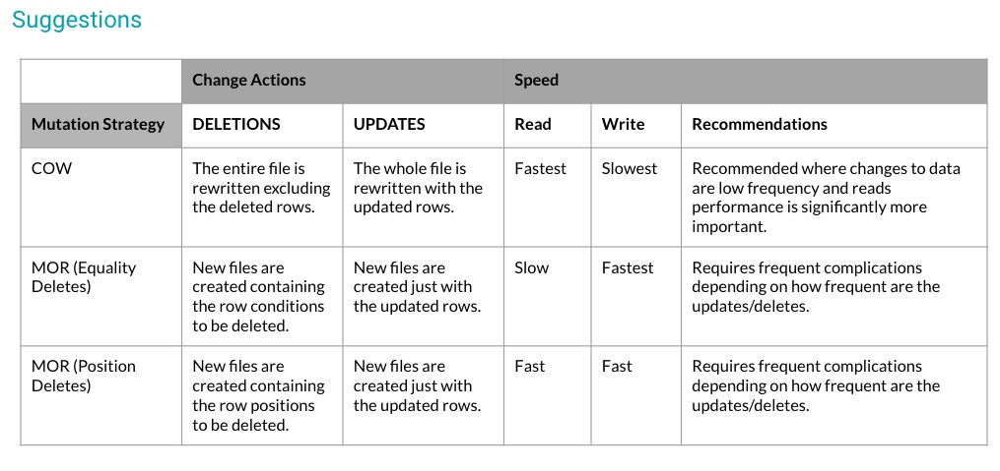
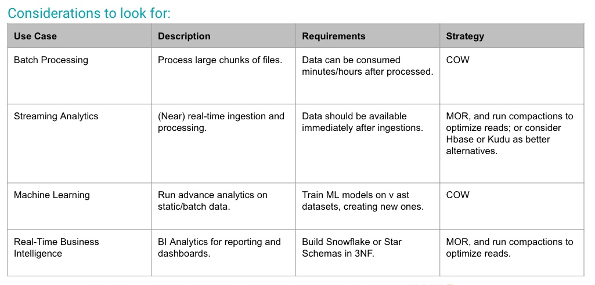

# Best Practice 07 - Row Level Mutations

## Overview
When using Iceberg tables through a computing engine or client library, it is common to view Iceberg primarily as a tool for reading and writing data. However, Iceberg is fundamentally an open community standard supported by a comprehensive table specification that guarantees compatibility across different languages and implementations. As designs for row-level mutations developed, it became clear that this feature would necessitate significant changes to the Iceberg table specification. In particular, enabling row-level deletes introduced a new concept—delete files. These files handle row-level deletions in two ways: position deletes indicate a specific data file path and the row position to be treated as deleted by readers, while equality deletes identify one or more column values, marking any row containing those values as deleted. This required extensive implementation updates across Iceberg clients and all compute engines, leading to the definition of a new version of the Iceberg table specification, V2.

The introduction of row-level mutations and the associated changes in the Iceberg table specification, particularly with the use of delete files, is considered a best practice for several reasons.

- **Granular Data Management** allows for precise updates and deletions, enabling more targeted data management. This flexibility is essential for maintaining accurate and relevant datasets.
- **Backward Compatibility** Defining these changes in a new version of the table specification (V2) ensures that existing systems can still function while allowing new features to be implemented, facilitating a smoother transition.
- **Support for Complex Use Cases** enables support for complex data workflows and use cases, such as data corrections, privacy compliance (e.g., GDPR), and real-time analytics, enhancing the overall utility of Iceberg.
- **Ecosystem Integration** The clear definition of row-level mutations in the Iceberg specification supports better integration across different compute engines and client libraries, ensuring that all components of the data ecosystem can work together seamlessly.

## IceTip

Understand the use case needs - how data will be ingested, processed, and consumed.

