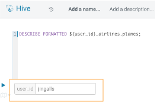

# Migrate Existing Tables to Iceberg Tables Using SQL

## Overview

This submodule guides you through two key methods for migrating existing tables to Iceberg format on the Cloudera Data Platform (CDP) using SQL commands. The methods covered are:

1. **In-Place Migration**: Convert an existing Hive or Impala table to Iceberg format without moving the data.
2. **Create Table as Select (CTAS)**: Create a new Iceberg table by selecting data from an existing table.

Both methods will help you leverage Iceberg's advanced features for efficient data management and query performance.

## Prerequisites

Before starting, ensure you have:

- Access to the Cloudera Data Platform (CDP) environment.
- Proper permissions to execute SQL commands in HUE for Hive Virtual Warehouse (VW) or Impala VW.
- Your `${prefix}` (e.g., your User ID) ready for use in the queries.

## Method 1: In-Place Migration (Convert Existing Table to Iceberg)

In this method, you'll convert an existing Hive or Impala table to Iceberg format, keeping the original data files in place.

### Step 1: Describe the Existing Table

First, describe the existing table to review its current properties.

1. Execute the following SQL command in HUE for Hive VW or Impala VW. Replace `${prefix}` with your chosen value (e.g., your User ID):

   ``` sql
   DESCRIBE FORMATTED ${prefix}_airlines.planes;
   ```

   

2. In the output, look for the following properties:

   - **Table Type**: Indicates the format of the table (e.g., MANAGED, EXTERNAL).
   - **SerDe Library**: Shows the Serializer/Deserializer used for the table.

   

### Step 2: Convert the Table to Iceberg

Next, you'll convert the table to Iceberg format.

1. Execute the following command:

   ``` sql
   ALTER TABLE ${prefix}_airlines.planes
      CONVERT TO ICEBERG;

   -- For Impala only; to use Iceberg version 2 table format, uncomment & run the following
   -- ALTER TABLE ${prefix}_airlines.planes SET TBLPROPERTIES('format-version'='2');
   ```

   ``` sql
   DESCRIBE FORMATTED ${prefix}_airlines.planes;
   ```

2. Review the output to ensure the conversion was successful. Key values to check include:

   - **Table Type**: Should now indicate "ICEBERG".
   - **Location**: Confirms where the table data is stored, typically in cloud storage (e.g., S3).
   - **SerDe Library**: Should now reference "HiveIcebergSerDe" for Iceberg tables.
   - **Table Parameters**: Look for properties like `MIGRATE_TO_ICEBERG`, `storage_handler`, `metadata_location`, and `table_type`.

     - **Metadata Location**: Points to the location of the Iceberg metadata, which references the original data files. This method saves time as it doesn't regenerate data files, only the metadata.
     - **Storage Handler & SerDe Library**: Ensure Iceberg-specific settings are applied, using the `HiveIcebergSerDe`.

      

### Summary of In-Place Migration

This method allows you to quickly migrate tables to Iceberg format without altering the original data files. The conversion focuses on updating the metadata, making it efficient and minimizing disruption.

## Method 2: Create Table as Select (CTAS)

The CTAS method creates a new Iceberg table by selecting data from an existing table. This is useful when you want to create a new table that fully leverages Iceberg's capabilities.

### Step 1: Drop the Existing Table (if necessary)

If a table with the target name already exists, you may need to drop it first:

   ``` sql
   DROP TABLE IF EXISTS ${prefix}_airlines.airports;
   ```

### Step 2: Create a New Iceberg Table

1. Execute the following SQL command in HUE for Hive VW:

   ``` sql
   CREATE EXTERNAL TABLE ${prefix}_airlines.airports
      STORED BY ICEBERG AS
      SELECT * FROM ${prefix}_airlines_csv.airports_csv;
   ```

   ``` sql
   DESCRIBE FORMATTED ${prefix}_airlines.airports;
   ```

2. In the output, verify that the `table_type` in the Table Parameters section confirms the table is now in "ICEBERG" format.

### Summary of CTAS

This method is ideal when you want to create a new table from scratch in Iceberg format. It offers the flexibility to migrate data from other sources or formats, ensuring that the new table fully benefits from Iceberg's advanced features.

## Conclusion

You’ve now learned two methods for migrating tables to Iceberg format: in-place conversion and CTAS. Both approaches allow you to take advantage of Iceberg's capabilities, whether you’re updating existing tables or creating new ones.
