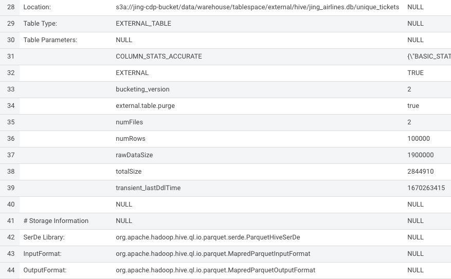

# Query Iceberg Table Format and Hive Table Format in the Same Query (in CDW HUE)

## Overview

This submodule demonstrates how to query both Iceberg and Hive table formats together within the same query using Cloudera Data Warehouse (CDW) HUE. This approach allows you to combine the strengths of both table formats and migrate to Iceberg over time without disrupting existing workflows.

## Prerequisites

Before starting, ensure you have:

- Access to Cloudera Data Warehouse (CDW) HUE.
- Proper permissions to execute SQL queries in Impala Virtual Warehouse (VW).
- Your `${prefix}` (e.g., your User ID) ready for use in the queries.

## Querying Combined Table Formats

### Step 1: Describe Existing Tables

First, describe the tables to confirm their formats. We already have the following tables in Iceberg format:

- **flights**: Created directly in Iceberg format.
- **planes**: Migrated to Iceberg format using the `ALTER TABLE` utility.
- **airports**: Created as a new Iceberg table using CTAS.

Now, let’s examine the `unique_tickets` table, which remains in Hive format (indicated by the `ParquetHiveSerDe` library).

  ``` sql
  -- [optional] SINGLE QUERY USING ICEBERG & HIVE TABLE FORMAT
  DESCRIBE FORMATTED ${prefix}_airlines.flights;
  DESCRIBE FORMATTED ${prefix}_airlines.unique_tickets;
  ```



### Step 2: Query Combining Hive and Iceberg Tables

Execute the following query to combine data from the Hive table (`unique_tickets`) and the Iceberg table (`flights`):

  ``` sql
  -- Query combining Hive Table Format (unique_tickets) and Iceberg Table Format (flights)
  SELECT 
    t.leg1origin,
    f.dest,
    count(*) as num_passengers
  FROM ${prefix}_airlines.unique_tickets t
  LEFT OUTER JOIN ${prefix}_airlines.flights f ON
    t.leg1origin = f.origin
    AND t.leg1dest = f.dest
  GROUP BY t.leg1origin, f.dest;
  ```

### Value

Combining Iceberg with Hive table formats allows you to gradually convert and migrate your data to Iceberg where it makes sense, without needing to migrate all tables at once. This flexibility supports a smoother transition to Iceberg over time, optimizing performance and manageability.

## Conclusion

In this submodule, you’ve learned how to query both Iceberg and Hive table formats together. This capability provides flexibility in data management and allows for a phased migration to Iceberg, ensuring minimal disruption to ongoing operations.
