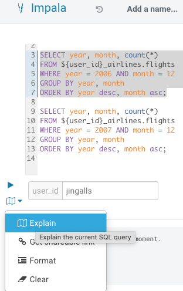
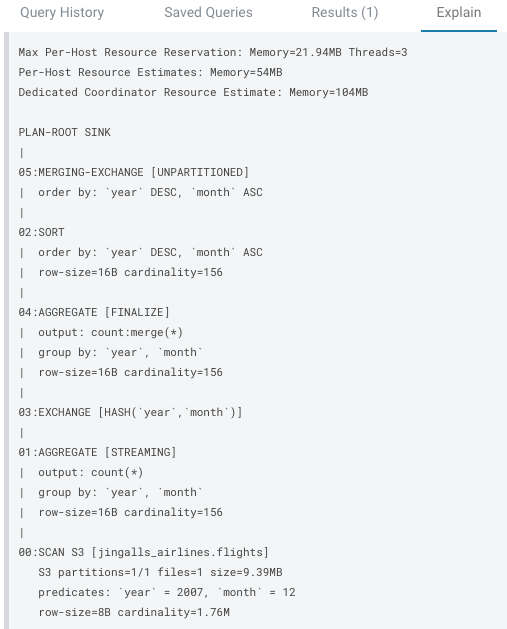

# Partition Evolution Using SQL

## Overview

In this submodule, we'll explore in-place partition evolution using SQL on the Cloudera Data Platform (CDP). Partition evolution is a powerful feature of Iceberg that allows you to modify the partitioning strategy of your tables with minimal data movement, enhancing query performance and scalability.

## Prerequisites

Before starting, ensure you have:

- Access to Cloudera Data Warehouse (CDW) HUE.
- Proper permissions to execute SQL commands in the Hive Virtual Warehouse (VW).
- Your `${prefix}` (e.g., your User ID) ready for use in the queries.

## Step-by-Step Guide

### Step 1: Modify the Partition Spec

Use the `ALTER TABLE` command to add a new partitioning level by month within the existing year partition for the `flights` table. This operation happens in-place, meaning that no data is physically moved, and the existing data remains indexed by year.

``` sql
ALTER TABLE ${prefix}_airlines.flights
SET PARTITION spec (year, month);
```

> **Note**: The partition evolution occurs in-place, so no data is physically moved, and the existing data remains indexed by year.

### Step 2: Verify the New Partitioning

After modifying the partitioning, run the following command to verify that the table is now partitioned by both year and month.

``` sql
SHOW CREATE TABLE ${prefix}_airlines.flights;
```

**Note**: In the output, look for the `Partition Spec` to confirm that the table is now partitioned by both year and month.


### Step 3: Load Additional Data

To take advantage of the new partitioning strategy, load additional data into the `flights` table. This example demonstrates loading data for the year 2007.

``` sql
INSERT INTO ${prefix}_airlines.flights
SELECT * FROM ${prefix}_airlines_csv.flights_csv
WHERE year = 2007;
```

### Step 4: Query the Iceberg Table Using Impala

Leverage the performance capabilities of Impala to query the Iceberg table and compare the benefits of the new partitioning strategy.

1. First, run the following query to analyze the data for the year 2006 (which uses the original year-only partition).

    ``` sql
    -- RUN EXPLAIN PLAN ON THIS QUERY
    SELECT year, month, count(*)
    FROM ${prefix}_airlines.flights
    WHERE year = 2006 AND month = 12
    GROUP BY year, month
    ORDER BY year desc, month asc;
    ```

2. Next, run the following query to analyze the data for the year 2007 (which uses the new year and month partition).

    ``` sql
    -- RUN EXPLAIN PLAN ON THIS QUERY; AND COMPARE RESULTS
    SELECT year, month, count(*)
    FROM ${prefix}_airlines.flights
    WHERE year = 2007 AND month = 12
    GROUP BY year, month
    ORDER BY year desc, month asc;
    ```

### Step 5: Analyze the Explain Plans

After running the queries, use the EXPLAIN feature in HUE to analyze the performance of each query.

1. Highlight the first `SELECT` statement up to the `;` and click on the EXPLAIN button. Scroll down to the bottom of the Explain tab to review the results.

    

    

2. Next, highlight the second `SELECT` statement up to the `;` and click on the EXPLAIN button again. Scroll down to the bottom of the Explain tab to review the results.

    

    

> **Explanation**: When comparing the Explain Plans, you'll observe that the query for `year=2006` (using the year partition) scans one partition (~120MB) even though it also filters on the month. However, the query for `year=2007` (using the year and month partition) only scans one month of data, which is one partition of about 9MB. This results in a significant performance boost.

**Query for year=2006**                                             **Query for year=2007**


### Summary

You have successfully evolved the partitions of your Iceberg table in-place using SQL, and demonstrated the performance benefits of optimized partitioning with Impala. This process allows you to maintain scalability and performance as your data evolves.

## Next Steps

To deepen your understanding of partition evolution, consider exploring the following:

- **[Partition Evolution Using Spark SQL](partition_evolution_SparkSQL.md):** Learn how to achieve partition evolution using Spark SQL, and how Spark's capabilities can complement this process.

- **[Partition Evolution Using Spark DataFrames](partition_evolution_SparkDF.md):** Explore how to programmatically manage partitions using Spark DataFrames, providing additional flexibility and control.

- **[Module 05 - Loading Data Multi-function Analytics](Module%2005%20-%20Loading%20Data%20Multi-function%20Analytics/README.md):** If you're interested in seeing how Iceberg's partitioning features support multi-function analytics, this module will be a great next step.

These submodules and modules will help you build on the foundational knowledge you've gained and explore more advanced capabilities of Iceberg tables.
