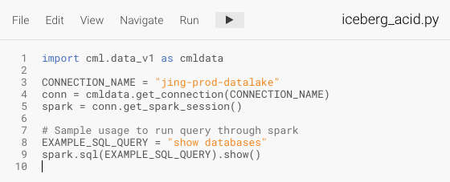
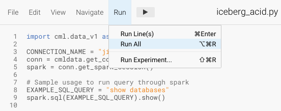
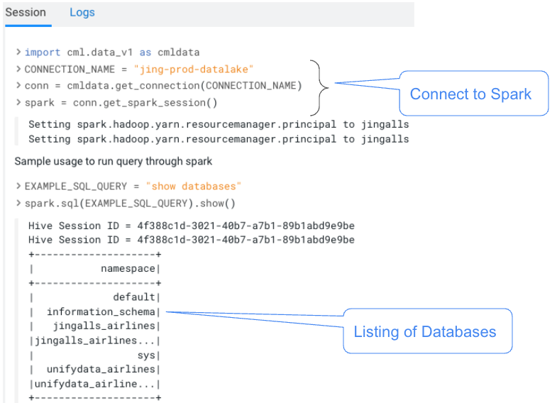

# SQL ACID Merge feature - shown in CML

In this section use CML to run though some of the Iceberg features using Spark again, by running some PySpark code.  Here we will primarily concentrate on taking advantage of the ACID capabilities of Iceberg.  Since we are using CML, this section also shows off the multi-function analytic feature of Iceberg.

**CML** 

- In CML, open the Workspace named (replace \<user-id> with your user id) **\<user-id>-iceberg-ml**

- Create a new Project

  - Project Name: **\<user-id>**-iceberg-project (replace \<user-id> with your user id)

  - Initial Setup: Template tab, select Python from the dropdown

  - Runtime Setup: Basic

    - Kernel: Python 3.7

- Left nav, select Files

  - Create New File (+ New; then select New File)

    - File Name: **iceberg\_acid.py**

    - Check Open in Editor


- Start New Session

  - Name: iceberg-acid-session

  - Editor: Workbench

  - Enable Spark, and select Spark 3.2.0 (Spark 3 is required for Iceberg functionality)


- From the Connection Code Snippet find and select the tile with TYPE = “Spark Data Lake”

  - Click the button in the top right corner of the Code Snippet and click Close


- When you are back in the Workbench, paste the code into the Editor



- Copy paste the following code, replacing \<user-id> with your user id, into the Workbench Editor after the code you copied connecting to the Spark Connection (from above screen you would start on line 11).  To summarize what this code will do: 1) create an Iceberg table, 2) load data into Iceberg table, and 3) updates a value in a row (ACID MERGE) - changes “United Airlines Inc.” to “Adrenaline Airways”.  WOW!!! What a Ride!!!! 

```
    ### Code to add
    # Replace <user-id> with your user id in the following code

    # Query Raw Data Table
    spark.sql("SELECT * FROM <user-id>_airlines_csv.airlines_csv limit 5").show()

    # Create Iceberg Table
    spark.sql("CREATE EXTERNAL TABLE <user-id>_airlines.airlines (code string, description string) USING ICEBERG  TBLPROPERTIES ('format-version' = '2')")

    # Load Data into Iceberg Table
    spark.sql("INSERT INTO <user-id>_airlines.airlines SELECT * FROM <user-id>_airlines_csv.airlines_csv")

    # Review Results to ensure record was updated
    spark.sql("SELECT * FROM <user-id>_airlines.airlines WHERE code ='UA'").show()

    # ICEBERG ACID - Change row for UA (United Airlines) to reflect new name of Adrenaline Airways 
    spark.sql('MERGE INTO <user-id>_airlines.airlines s USING (SELECT t.code, "Adrenaline Airways" AS description FROM <user-id>_airlines.airlines t WHERE t.code = "UA") source \
    ON s.code = source.code \
    WHEN MATCHED AND s.description <> source.description THEN UPDATE SET s.description = source.description \
              ')

    # Review Results to ensure record was updated
    spark.sql("select * from <user-id>_airlines.airlines where code ='UA'").show()
```

- Once you’ve pasted the code at the end of the connection click on Run > Run All



-  The Session output will show the following



