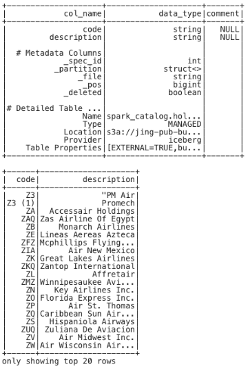

# Evolve Iceberg Table Schema Using Spark DataFrames

## Overview

In this submodule, we will explore in-place schema evolution using Spark DataFrames within a Cloudera Data Engineering (CDE) session. Schema evolution allows you to modify table schemas without moving data, providing flexibility to adapt to evolving business needs.

## Prerequisites

Before starting, ensure you have:

- Access to a Cloudera Data Engineering (CDE) session.
- Proper permissions to execute Spark commands.
- Your `${prefix}` (e.g., your User ID) ready for use in the code.

## Step-by-Step Guide

### Step 1: Set Up Variables

Begin by setting up your environment variables. Replace `<prefix>` with your unique value (e.g., your User ID).

``` spark
from pyspark.sql.functions import col
from pyspark.sql.functions import current_timestamp

# Variables - replace <prefix> with your prefix
prefix = "<prefix>"
odl_database_name = prefix + "_airlines"
```

### Step 2: Check Current Schema

Before evolving the schema, check the current schema of the `airlines` table. This will confirm that the table currently has two columns: `code` and `description`.

``` spark
# CHECK TABLE FORMAT - before in-place schema evolution
spark_df = spark.sql(f"DESCRIBE FORMATTED {odl_database_name}.airlines")
spark_df.show()

# Query data to see data prior to evolving the schema
spark_df = spark.read.format("iceberg").table(f"{odl_database_name}.airlines").orderBy(col("code"), ascending=True)

# Filter rows where the 'code' column is greater than 'Z'
filtered_df = spark_df.filter(col("code") > "Z")

# Show the results
filtered_df.show()
```



### Step 3: Evolve the Schema In-Place

Use Spark SQL to add additional columns (`status`, `updated`) to the table. This operation happens in-place, evolving the schema without moving any existing data.

``` spark
# EVOLVE SCHEMA IN-PLACE - add columns to the schema
spark.sql(f"ALTER TABLE {odl_database_name}.airlines ADD COLUMNS(status STRING, updated TIMESTAMP)").show()
```

### Step 4: Verify the New Schema

After evolving the schema, verify that the table is now using the new schema.

```
# CHECK TABLE FORMAT - after schema evolution
spark_df = spark.sql(f"DESCRIBE FORMATTED {odl_database_name}.airlines")
spark_df.show()

# Query data to see new columns but defaulted to NULL; existing data NOT rewritten
spark_df = spark.read.format("iceberg").table(f"{odl_database_name}.airlines").orderBy(col("code"), ascending=True)

# Filter rows where the 'code' column is greater than 'Z'
filtered_df = spark_df.filter(col("code") > "Z")

# Show the results
filtered_df.show()
```


### Step 5: Load and Write Data Using Spark DataFrames

To leverage the new schema, insert a row into the `airlines` table using Spark DataFrames.

``` spark
# Insert new row with NEW columns
data = [
    ('Z999', 'Adrenaline Airways', 'NEW') 
]

columns = ['code', 'description', 'status']

# Convert data into a DataFrame
spark_df = spark.createDataFrame(data, columns)

spark_df = df.withColumn("updated", current_timestamp())

# Add new record with new schema to the table
spark_df.writeTo(f"{odl_database_name}.airlines").using("iceberg").append()
```

### Step 6: Verify the Data Load

After loading the data, run a query to verify that the data has been correctly inserted into the Iceberg table and is using the `status` and `updated` columns.

``` spark
# Query data to see new column populated
spark_df = spark.read.format("iceberg").table(f"{odl_database_name}.airlines").orderBy(col("code"), ascending=True)

# Filter rows where the 'code' column is greater than 'Z'
filtered_df = spark_df.filter(col("code") > "Z")

# Show the results
filtered_df.show()
```


## Summary

In this submodule, you evolved the schema of an Iceberg table in-place using Spark DataFrames. You learned how to modify the schema without moving data and inserted records to take advantage of the new schema columns.

## Next Steps

To explore more advanced features of Iceberg, continue with the next module:

- **[Module 09 - Security](Module%2009%20-%20Security/README.md)**: Learn how to implement security controls and policies for your Iceberg tables using Cloudera’s security tools.
