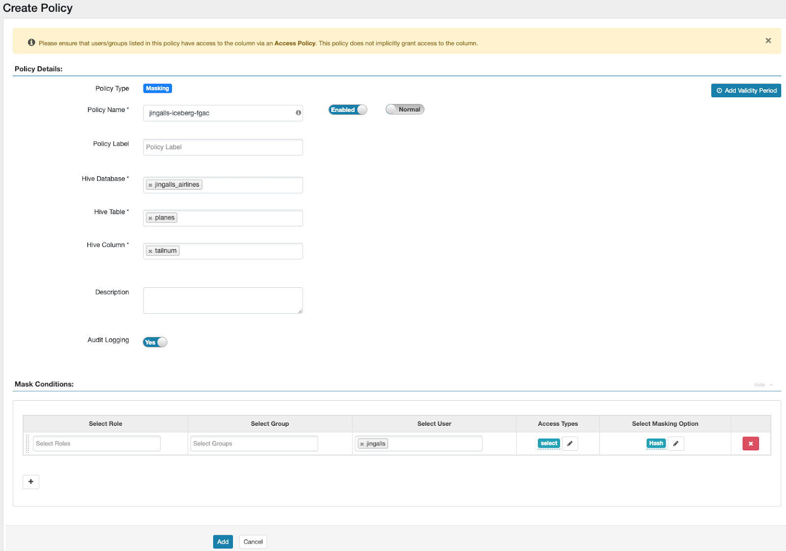

# SQL Masking Policy

## Overview

In this submodule, we will implement a fine-grained access control (FGAC) policy using **Ranger** to mask sensitive data in the `Tailnum` column of the `planes` Iceberg table. You will apply a masking policy in the **Ranger UI**, which will protect sensitive information by replacing it with hashed values.

## Step-by-Step Guide

### Step 1: Query the Planes Table (Unmasked Data)

Start by querying the `planes` Iceberg table in Cloudera Data Warehouse (CDW) using Hue/Impala to see the unmasked `Tailnum` column.

``` sql
SELECT * FROM ${prefix}_airlines.planes;
```

- In the results, you will see that the `Tailnum` column is displayed in plain text.

### Step 2: Enable the Ranger Masking Policy

Follow these steps to enable the Ranger policy that masks the `Tailnum` column:

1. Open the **Ranger UI** for your CDP environment.
2. In the **Hadoop SQL** section, find and edit the policy named `${prefix}-iceberg-fgac` (replace `${prefix}` with your user ID).
3. Within the policy details, click **Disabled** to enable the policy.



4. Click **Save** to apply the policy.

### Step 3: Query the Planes Table (Masked Data)

Now, execute the same query again in Hue/Impala to verify that the `Tailnum` column has been masked:

``` sql
SELECT * FROM ${prefix}_airlines.planes;
```

- In the results, you will see that the `Tailnum` column is now hashed, confirming that the masking policy is successfully applied.


## Summary

In this submodule, you implemented a fine-grained access control (FGAC) policy using Ranger to mask sensitive data in the `planes` table. The policy was applied to the `Tailnum` column, demonstrating how Ranger’s masking feature protects sensitive information by replacing it with hashed values.

## Next Steps

To continue exploring security measures in CDP, consider these modules:

- **[Module 10 - Data Catalog](Module%2010%20-%20Data%20Catalog/README.md)**: Learn how to manage and discover Iceberg tables through the Cloudera Data Catalog.
