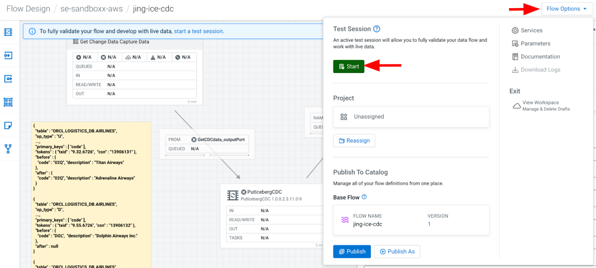
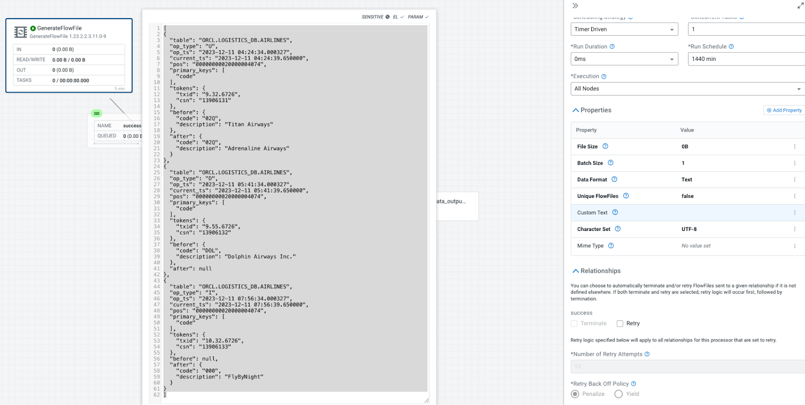
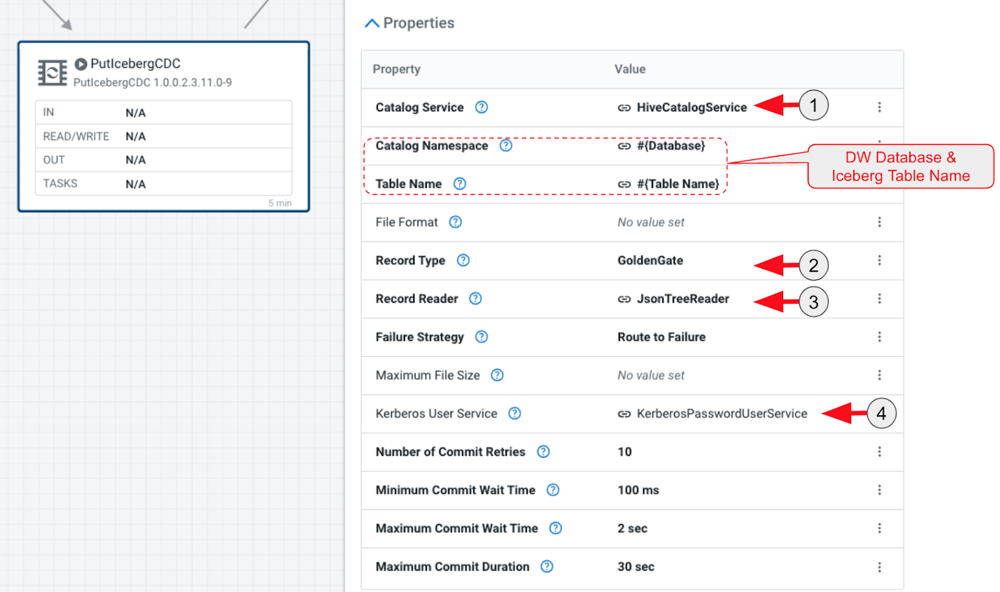
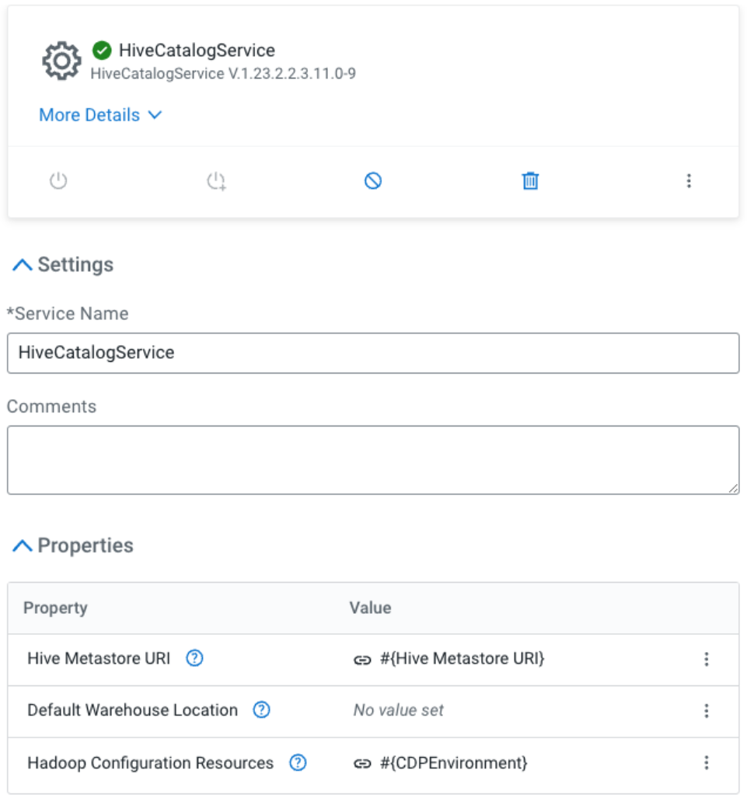
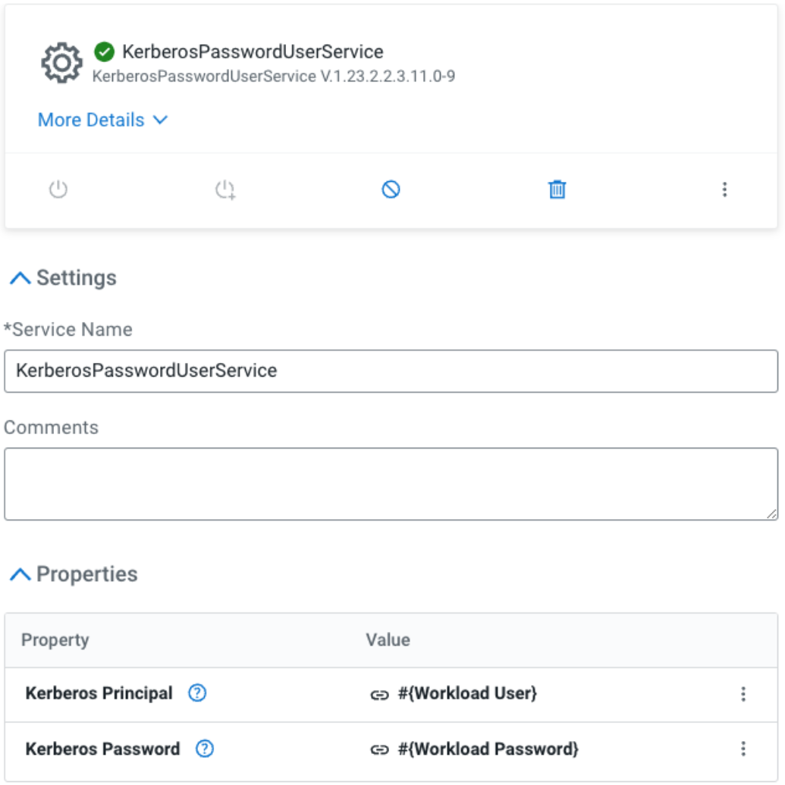
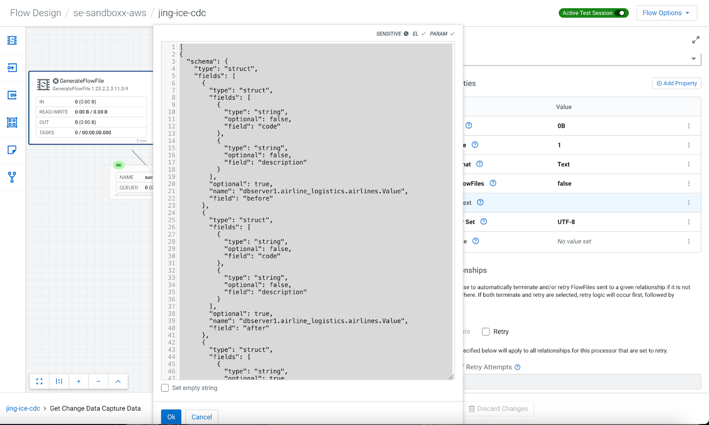

# CDC GoldenGate Data Flow

## PutIcebergCDC Processor - CDF Flow Designer

- This Flow will simulate loading CDC transactions related to Airline Carrier changes

- The Flow will process an Update, a Delete, and an Insert into the target Iceberg table

- The Iceberg table “airlines” must be using the v2 Iceberg format ie. TBLPROPERTIES ("format-version"="2")

- The source is a GenerateFlowFile processor that has a JSON that mimics what data would be transmitted from GoldenGate

- The target is the “**\<prefix>\_airlines.airlines**” Iceberg table

- **NOTE:** the CDC data can be written the the Iceberg table as singleton inserts, deletes, and updates.  HOWEVER, if you try to query the Iceberg table (as of 2023-12-14) immediately after writing the data the query WILL Fail.

  - Failure is due to not supporting Equality Deletes currently

  - To resolve you first need to run “Table Compaction” and then the query will work successfully

|                                                                                                                                                                                                   |                                                                                                                                                                                                                          |
| :-----------------------------------------------------------------------------------------------------------------------------------------------------------------------------------------------: | ------------------------------------------------------------------------------------------------------------------------------------------------------------------------------------------------------------------------ |
|  | Click on Flow Design -> |

**Setup**

Download the Flow Definition - [here](https://drive.google.com/open?id=1fjDf0FbN77fqV6OX20DkNNUMT5kn3gh1)

- **Prerequisite** steps

  - Ensure you have DFFlowAdmin Role for the Environment


- Open DataFlow > Catalog


1. Import the Flow Definition - click on the “Import Flow Definition” button

   - Give the flow a name - “**\<prefix>-ice-cdc-version-1**”

   - Upload the Flow Definition .json file you just downloaded

   - Click the Import button


**Getting the Flow to Execute**

- Create New Draft from Catalog - click on “\<prefix>-ice-cdc” flow to open the properties page


- Click on “Create New Draft” button to create a New Draft


- In “Target Workspace” select your CDF Environment

- Target Project - is optional

- In “Draft Name” name the Draft “**\<prefix>-ice-cdc**”

- Click on the “Create” button


- This will open the Draft in **Flow Designer** - for draft named “**\<prefix>-ice-cdc**”

  1. Modify Parameters - 


- Database - modify to “\<prefix>\_airlines”

- Table Name - name of the table to apply CDC transactions to; no change required

- Hive Metastore URI - URI to the Hive Metastore, found in your Datalake settings

  - Go to Environment > click on Data Lake tab > click on Nodes in the bottom left corner

  - Under the Master section - you will see 1 or 2 nodes

    - Click on the copy button to the right of each Master node

    - The format of the Hive Metastore URI is - for 1 node = thrift://\<first-copied-fqdn>:9083; for 2 nodes = thrift://\<first-copied-fqdn>:9083,thrift://\<second-copied-fqdn>:9083

      - Replace the \<first/second-copied-fqdn> by pasting the copied FQDNs


- Workload User - your workload user that you use to sign in to CDP

- Workload Password - your workload password

* Start Test Session - click on “Flow Options” > Start buttons.  This will take several minutes to start



Click “Start Test Session” button


- Enable **all** Controller Services - click on “Flow Options” > Services.


1. Enable each of these Services - by selecting the Service and then clicking on the Enable button for each Service


- HiveCatalogService

- JsonRecordSetWriter

- JsonTreeReader

- KerberosPasswordUserService

* Run the Flow - **start** the following Processors as specified

  1. In the “Get Change Data Capture Data” Processor Group

     - Start the ConvertRecord Processor

     - Start the SplitJSON Processor

     - Start the GetCDCdata\_outputPort Output Port

     - Run the GenerateFlowFile Processor, just 1time.  Right click on the processor and select “Run Once”


2. On the main canvas

   - View the generated CDC Records that are now in the Queue - right click on the Connection going into the PutIcebergCDC processor and click on “List Queue”


- Select any 1 of the items in the Queue


- Click on “Open in Data Viewer”


You will see the Data Viewer - show the contents of the FlowFile


- Start the PutIcebergCDC Processor to send the CDC records to change the Airlines table

  - Check what has been changed by going to HUE and querying the airlines table


#### GoldenGate

**Detailed Information on Flow - GenerateFlowFile \[located in “Get Change Data Capture Data” Process Group] (GoldenGate)**

This CDC example will simulate data coming from GoldenGate by using a GenerateFlowFile Processor.  This example concentrates on the aspects that write the changes to an Iceberg table.  Normally, the data would come from a Kafka topic.



- The CDC records for this example will use the “GoldenGate” record format

  - This processor is set up to run 1 time per day for now to avoid situations where this processor can send a bunch of records at 1 time, but should only be run 1 time.  Once the records are updated there is no need to run this again

  - This is a JSON representation of the records to be changed (truncated to show the important parts of the JSON record)

    - “op-code” reflects the CDC operation to be performed

      - “I” - indicates this record will be inserted

        - The “before” section of the JSON record should be “null”

        - The “after” section of the JSON record will contain the data to be inserted in the schema of the target table

```
    {
      "table" : "ORCL.LOGISTICS_DB.AIRLINES",
      "op_type" : "I",
      ...,
      "before" : null,
      "after" : {
        "code" : "000", "description" : "FlyByNight"
      }
    }
```

- “U” - indicated this record will be updated

  - The “before” record will contain the data to be changed in the schema of the target table 

  - The “after” record will contain the data of the new value in the schema of the target table

```
    {
      "table" : "ORCL.LOGISTICS_DB.AIRLINES",
      "op_type" : "U",
      ...,
      "before" : {
        "code" : "02Q", "description" : "Titan Airways"
      },
      "after" : {
        "code" : "02Q", "description" : "Adrenaline Airways"
      }
    }
```

- “D” - indicates this record will be deleted

  - The “before” record will contain the data to be deleted in the schema of the target table

  - The “after” section of the JSON record should be “null”

```
    {
      "table" : "ORCL.LOGISTICS_DB.AIRLINES",
      "op_type" : "D",
      ...,
      "before" : {
        "code" : "DOL",  "description" : "Dolphin Airways Inc."
      },
      "after" : null
    } 
```

**Detailed Information on Flow - PutIcebergCDC (GoldenGate)**

This processor will write the CDC changes to the Iceberg Table specified within the Properties of this Processor.



- The PutIcebergCDC Processor will update, insert, and/or delete records using an existing Iceberg table.  The records are read using the Record Reader.

- File Format describes the file format for the Iceberg table, by default this processor uses PARQUET, but you could also use ORC or AVRO.  Since this is blank it will used the value of “write.format.default”, which for this Data Lakehouse happens to be set to PARQUET

- The Iceberg table that will have records inserted into will be identified by the “Catalog Namespace” and “Table Name” properties

  - The “Catalog Namespace” is equivalent to the Database Name in the Data Lakehouse

  - The “Table Name” is obviously the name of the Iceberg table

  - These properties are Parameterized to allow for changes to these properties

- There are 4 other Properties that are required to be defined

1. Catalog Service - **HiveCatalogService**

   - To configure the Catalog Service you need to provide:

     - The Hive Metastore URI(s) - URI to the Hive Metastore, found in your Datalake settings and will be in the format: thrift://\<datalake-master0-uri>:9083 \[,thrift://\<datalake-master1-uri>:9083]

     - The Hadoop Configuration Resources - use the “CDPEnvironment” parameter



- These Properties are Parameterized to allow for varying Environments to be configured

2. RecordType - select “**GoldenGate**” for this example as this is the format of the incoming CDC Records.

3. Record Reader

   - The record is in a JSON format.


- Properties - use Schema Access Strategy of “Infer Schema”

4. Kerberos User Service

   - This Service will identify the Principal User and Password used to connect to the Hive Metastore Service



- These Properties are Parameterized to allow any user to run the flow (as long as they have access to write to the Iceberg Table)


#### Debezium

**Detailed Information on Flow - GenerateFlowFile \[located in “Get Change Data Capture Data” Process Group] (Debezium)**

If you choose to use Debezium, the same details apply with the following changes.

This CDC example will simulate data coming from Debezium by using a GenerateFlowFile Processor.  This example concentrates on the aspects that write the changes to an Iceberg table.  Normally, the data would come from a Kafka topic.



- The CDC records for this example will use the “Debezium” record format

  - This processor is set up to run 1 time per day for now to avoid situations where this processor can send a bunch of records at 1 time, but should only be run 1 time.  Once the records are updated there is no need to run this again

  - This is a JSON representation of the records to be changed (truncated to show the important parts of the JSON record)

    - “schema” defines the schema on the Debezium records

      - There are 3 sections within the “schema” - 1) “before”, 2) “after”, and 3) “source” (see the following within the “fields\[]” section  - "field": "before" and "field": "after")

      - The “before” and “after” sections will define the schema of the records in the table being changed via the CDC records

      - The “source” section is the fields that will describe where the CDC records come from - this schema does not need to be modified

    - “payload” - is the actual CDC details on the ACID operation to perform.  The “schema” section describes what is in this section.

    - “op-code” reflects the CDC operation to be performed

      - “c” - indicates this record will be inserted

        - Within the “payload” section

          - The “before” section of the JSON record should be “null”

          - The “after” section of the JSON record will contain the data to be inserted in the schema of the target table

          - The “source” section has 3 fields that represent the source database and table for the CDC record - 1) “name” - is the server where the source DB is running, 2) “db” - is the database name where the table resides, and 3) “table” - is the table name for the CDC record

```
    {
      "schema": {
        "type": "struct",
        "fields": [
          {
            "type": "struct",
            "fields": [
              { "type": "string","optional": false,"field": "code" },
              { "type": "string","optional": false,"field": "description" }
            ],
            "optional": true,
            "name": "dbserver1.airline_logistics.airlines.Value",
            "field": "before"
          },
          {
            "type": "struct",
            "fields": [
              { "type": "string","optional": false,"field": "code" },
              { "type": "string","optional": false,"field": "description" }
            ],
            "optional": true,
            "name": "dbserver1.airline_logistics.airlines.Value",
            "field": "after"
          },
          {
            "type": "struct",
            "fields": [
              { "type": "string","optional": true,"field": "version" },
              { "type": "string","optional": false,"field": "name" },
    ...,
              { "type": "string","optional": true,"field": "db" },
              { "type": "string","optional": true,"field": "table" }
            ],
            "optional": false,
            "name": "io.debezium.connector.mysql.Source",
            "field": "source"
          },
          { "type": "string","optional": false,"field": "op" },
          { "type": "int64","optional": true,"field": "ts_ms" }
        ],
        "optional": false,
        "name": "dbserver1.airline_logistics.airlines.Envelope",
        "version": 1
      },
      "payload": {
        "before": null,
        "after": {
          "code": "000", "description": "FlyByNight"
        },
        "source": {
          "version": "2.5.0.Final",
          "name": "dbserver1",
    ...,
          "db": "airline_logistics",
          "table": "airlines"
        },
        "op": "c",
        "ts_ms": 1486500577691
      }
    }
```

- “u” - indicated this record will be updated

  - Within the “payload” section

    - The “before” record will contain the data to be changed in the schema of the target table 

    - The “after” record will contain the data of the new value in the schema of the target table

    - The “source” section has 3 fields that represent the source database and table for the CDC record - 1) “name” - is the server where the source DB is running, 2) “db” - is the database name where the table resides, and 3) “table” - is the table name for the CDC record

```
    {
      "schema": {
        "type": "struct",
        "fields": [
          {
            "type": "struct",
            "fields": [
              { "type": "string","optional": false,"field": "code" },
              { "type": "string","optional": false,"field": "description" }
            ],
            "optional": true,
            "name": "dbserver1.airline_logistics.airlines.Value",
            "field": "before"
          },
          {
            "type": "struct",
            "fields": [
              { "type": "string","optional": false,"field": "code" },
              { "type": "string","optional": false,"field": "description" }
            ],
            "optional": true,
            "name": "dbserver1.airline_logistics.airlines.Value",
            "field": "after"
          },
          {
            "type": "struct",
            "fields": [
              { "type": "string","optional": true,"field": "version" },
              { "type": "string","optional": false,"field": "name" },
    ...,
              { "type": "string","optional": true,"field": "db" },
              { "type": "string","optional": true,"field": "table" }
            ],
            "optional": false,
            "name": "io.debezium.connector.mysql.Source",
            "field": "source"
          },
          { "type": "string","optional": false,"field": "op" },
          { "type": "int64","optional": true,"field": "ts_ms" }
        ],
        "optional": false,
        "name": "dbserver1.airline_logistics.airlines.Envelope",
        "version": 1
      },
       "before": {
          "code": "02Q",
          "description": "Titan Airways"
        },
        "after": {
          "code": "02Q",
          "description": "Adrenaline Airways"
        },
        "source": {
          "version": "2.5.0.Final",
          "name": "dbserver1",
    ...,
          "db": "airline_logistics",
          "table": "airlines"
        },
        "op": "u",
        "ts_ms": 1486500577291
      }
    }
```

- “d” - indicates this record will be deleted

  - Within the “payload” section

    - The “before” record will contain the data to be deleted in the schema of the target table

    - The “after” section of the JSON record should be “null”

    - The “source” section has 3 fields that represent the source database and table for the CDC record - 1) “name” - is the server where the source DB is running, 2) “db” - is the database name where the table resides, and 3) “table” - is the table name for the CDC record

```
    {
      "schema": {
        "type": "struct",
        "fields": [
          {
            "type": "struct",
            "fields": [
              { "type": "string","optional": false,"field": "code" },
              { "type": "string","optional": false,"field": "description" }
            ],
            "optional": true,
            "name": "dbserver1.airline_logistics.airlines.Value",
            "field": "before"
          },
          {
            "type": "struct",
            "fields": [
              { "type": "string","optional": false,"field": "code" },
              { "type": "string","optional": false,"field": "description" }
            ],
            "optional": true,
            "name": "dbserver1.airline_logistics.airlines.Value",
            "field": "after"
          },
          {
            "type": "struct",
            "fields": [
              { "type": "string","optional": true,"field": "version" },
              { "type": "string","optional": false,"field": "name" },
    ...,
              { "type": "string","optional": true,"field": "db" },
              { "type": "string","optional": true,"field": "table" }
            ],
            "optional": false,
            "name": "io.debezium.connector.mysql.Source",
            "field": "source"
          },
          { "type": "string","optional": false,"field": "op" },
          { "type": "int64","optional": true,"field": "ts_ms" }
        ],
        "optional": false,
        "name": "dbserver1.airline_logistics.airlines.Envelope",
        "version": 1
      },
      "payload": {
       "before": {
          "code": "DOL",
          "description": "Dolphin Airways Inc."
        },
        "after": null,
        "source": {
          "version": "2.5.0.Final",
          "name": "dbserver1",
    ...,
          "db": "airline_logistics",
          "table": "airlines"
        },
        "op": "d",
        "ts_ms": 1486500577091
      }
    }
```

**Detailed Information on Flow - PutIcebergCDC (Debezium)**

This processor will write the CDC changes to the Iceberg Table specified within the Properties of this Processor.


- The PutIcebergCDC Processor will update, insert, and/or delete records using an existing Iceberg table.  The records are read using the Record Reader.

- The Iceberg table that will have records inserted into will be identified by the “Catalog Namespace” and “Table Name” properties

  - The “Catalog Namespace” is equivalent to the Database Name in the Data Lakehouse

  - The “Table Name” is obviously the name of the Iceberg table

  - These properties are Parameterized to allow for changes to these properties

- There are 4 other Properties that are required to be defined

1. Catalog Service - **HiveCatalogService**

   - To configure the Catalog Service you need to provide:

     - The Hive Metastore URI(s

     - The Hadoop Configuration Resources - use the “CDPEnvironment” parameter

   - These Properties are Parameterized to allow for varying Environments to be configured

2. RecordType - select “**Debezium**” for this example as this is the format of the incoming CDC Records.

3. Record Reader

   - The record is in a JSON format.

   - Properties - use Schema Access Strategy of “Infer Schema”

4. Kerberos User Service

   - This Service will identify the Principal User and Password used to connect to the Hive Metastore Service

   - These Properties are Parameterized to allow any user to run the flow (as long as they have access to write to the Iceberg Table)


## CDE - Session (run Table Compaction)

Once this flow completes - **_you MUST run Table Compaction_** before querying the data in the airlines table after running the PutIcebergCDC Processor.

Otherwise you will get this error message or similar depending on whether you are running Hive or Impala.

This will not be necessary in the near future, but for now Table Compaction must be run first before you can query the data.  Once Equality Deletes are supported, this step will not be required and this step will become part of the regular table maintenance process to ensure that performance is the best possible.

The compaction can be run in the background (ie. a scheduled CDE Job).  Just note that getting the timing to line up before the query runs could be difficult, unless you do something like run the Job every minute - which is not the best idea, especially if you try this for a larger amount of CDC transactions.

Using a CDE Session was the easiest way to accomplish running the Table Compaction - this also shows the strength of multi-function analytics as you can use any engine against a single copy of the data.

The size of the compaction is super small for this to ensure that the compaction will run against these small files that will be created for the airlines table (each record is only maybe 25-50 bytes).  Normally this size would be much larger like 256-512MB.

```
    # SPARK CODE to compact Airlines Iceberg Table after CDC

    prefix = "<prefix>"

    table_name = prefix + "_airlines.airlines"

    spark.sql("CALL spark_catalog.system.rewrite_data_files(table => '" + table_name + "', options => map('target-file-size-bytes','50'))").show()
```     
