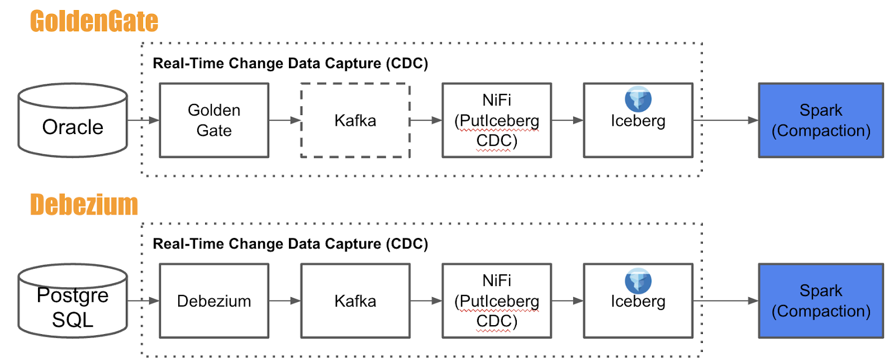
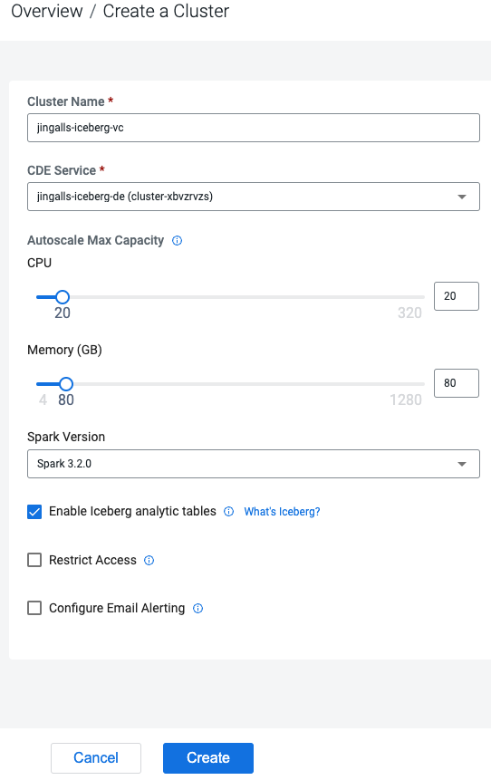

# Module 13 - Ingestion

## Ingestion with Iceberg and NiFi

This module covers setting up and running Iceberg Processors in NiFi for data ingestion into an Iceberg Data Lakehouse on Cloudera Data Platform (CDP).

**Focus on Iceberg Data Lakehouse and NiFi Processors**

The guide concentrates on:

- Using PutIceberg and PutIcebergCDC Processors for data ingestion.
- Demonstrating these processors within the context of an Airline data lakehouse powered by Apache Iceberg.

**Prerequisites (briefly mentioned):**

- A CDP environment with S3 bucket access.
- Basic understanding of Apache Iceberg and NiFi.

**Data Source and Schema**

The example uses airline data in CSV format, focusing on flights and airlines tables.

**Iceberg Table Creation (HUE):**

The guide provides SQL code to execute in HUE for creating the Iceberg tables (`airlines`, `planes`, `airports`, and `flights`) within a designated database (e.g., `${user_id}_airlines`). The `flights` table is created as a partitioned table.

**NiFi Flow Development is Out of Scope**

While this module mentions using NiFi for data ingestion, it does not cover the specifics of developing the NiFi flow itself. It highlights the usage of PutIceberg and PutIcebergCDC Processors but leaves the flow design for a separate document.

**Key Takeaways:**

- This module focuses on setting up the Iceberg Data Lakehouse and understanding the role of NiFi Processors for data ingestion.
- Separate documentation likely exists for developing the NiFi flow itself.

**Remember to replace `${user_id}` with your actual user ID throughout the process.**

To begin, select one of the sub-modules below:

## Submodules

`01` [Load New Data](load_new_data_to_flights_DF.md)

`02` [Change Data Capture with Debezium](change_data_capture_debezium_DF.md)

`03` [Change Data Capture with GoldenGate](change_data_capture_goldengate_DF.md)

`04` [Custom Change Data Capture ](change_data_capture_custom_DF.md)


------- ***HOLDING ONTO THE FOLLOWING IN CASE WE NEED THIS LATER*** --------
# Summary (to be EDITED) most of the following can be removed/reduced, but there is probably something here to save or reuse)

This document will describe how to setup and run the Iceberg Processors in NiFi (DataFlow Data Service - Flow Designer/Catalog/etc., DataHub Flow Management - NiFi, or CDF - NiFi on-prem).  These instructions include: 1) setup of the Data Lakehouse; and 2) Instructions on using the PutIceberg & PutIcebergCDC Processors.  These instructions do not include full details on setup and installation of: the Cloud CDP Environment, the PvC Data Service installation, and/or the CDP Base Cluster.

Use Case: Airline specific, using a Data Lakehouse powered by Apache Iceberg.  The following schema will be used, for this document the 2 tables being used are: 1) **flights**, and 2) **airlines**.


Schema used for this Document

The general flow for CDC processing for an Open Data Lakehouse powered by Apache Iceberg  is depicted below.  However, changes can be made depending on the source CDC system and technology requirements (the changes could be, for example: customer is already writing the GoldenGate CDC records to a file and to make a change to write them to Kafka would be cost prohibitive, then you could eliminate Kafka from the flow and pick up the CDC records directly from the file they are written to).  Also, please note that **_Iceberg may/may not be the best solution for fast changing data_** (million+ records being updated/deleted per second or minute) and in some cases it might make more sense to propose **_Kudu_** instead of Iceberg.



However, for this document we will start directly with NiFi (Flow Designer) for the CDC data processing and skip the actual part that is doing the CDC capture _\[this may be added in a later version of this document]_.  Within NiFi we will generate the CDC data using JSON records to simulate acquiring CDC records and then applying the changes.


2. # Install/Setup (including Data Lakehouse - Iceberg)

**Sandbox Tenant**

**Environment:** se-sandboxx-aws \<OR> create your own


## CDP Environment

- **REQUIRED:** you must have access to the S3 bucket for whatever CDP Environment you plan to use

- You have two (2) options

1. Use an existing CDP Environment in the Sandbox Tenant, such as se-sandboxx-aws

2. Create your own CDP Environment \[for screenshots in this Runbook, this is the route that was used]


## Getting Airline Data to Cloud Storage

- Download files from Google Drive in this [folder](https://drive.google.com/drive/folders/1y0bHTrco4qiFBozEbnoCsD2vG19htRWS?usp=share_link)

* In the AWS Console for s3 

  - Upload the “airlines-csv” folder and data to the CDP Environment’s “data” directory.  


## Cloudera Data Flow (CDF)

- Create DataHub Flow Management Light Duty cluster

  - Create a DataHub cluster using the Flow Management Light Duty template

    - Name: “**\<user-id>**-dataflow-light”

- Enable CDF for the Environment, if not already enabled


## Create CDW Virtual Warehouse

- Create a CDW Hive Virtual Warehouses attached to the Default Database Catalog, replace \<user-id> with your user id

  - Create a Hive VW

    - Name: “**\<user-id>**-iceberg-hive-vw”

    - Type: Hive

    - Database Catalog: select the Default DBC for the Environment you are using

    - Size: x-small

    - Leave remaining options as default


## Setting up the Databases for the Data Lakehouse (Iceberg)

- Execute the following in HUE using the Hive VW named **\<user-id>-iceberg-hive-vw**

  - Copy & paste the SQL (`in gray`) below

    - HUE has determined that there are 2 parameters that need to be entered, in the “user\_id” box enter your user id; and in the “cdp\_env\_bucket” box enter the CDP Environment bucket name


```
    -- CREATE DATABASES
    CREATE DATABASE ${user_id}_airlines_csv;
    CREATE DATABASE ${user_id}_airlines;

    -- CREATE CSV TABLES
    drop table if exists ${user_id}_airlines_csv.flights_csv;

    CREATE EXTERNAL TABLE ${user_id}_airlines_csv.flights_csv (month int, dayofmonth int, dayofweek int, deptime int, crsdeptime int, arrtime int, crsarrtime int, uniquecarrier string, flightnum int, tailnum string, actualelapsedtime int, crselapsedtime int, airtime int, arrdelay int, depdelay int, origin string, dest string, distance int, taxiin int, taxiout int, cancelled int, cancellationcode string, diverted string, carrierdelay int, weatherdelay int, nasdelay int, securitydelay int, lateaircraftdelay int, year int)
    ROW FORMAT DELIMITED FIELDS TERMINATED BY ',' LINES TERMINATED BY '\n'
    STORED AS TEXTFILE LOCATION 's3a://${cdp_env_bucket}/airlines-csv/flights' tblproperties("skip.header.line.count"="1");

    drop table if exists ${user_id}_airlines_csv.planes_csv;

    CREATE EXTERNAL TABLE ${user_id}_airlines_csv.planes_csv (tailnum string, owner_type string, manufacturer string, issue_date string, model string, status string, aircraft_type string, engine_type string, year int)
    ROW FORMAT DELIMITED FIELDS TERMINATED BY ',' LINES TERMINATED BY '\n'
    STORED AS TEXTFILE LOCATION 's3a://${cdp_env_bucket}/airlines-csv/planes' tblproperties("skip.header.line.count"="1");

    drop table if exists ${user_id}_airlines_csv.airlines_csv;

    CREATE EXTERNAL TABLE ${user_id}_airlines_csv.airlines_csv (code string, description string) 
    ROW FORMAT DELIMITED FIELDS TERMINATED BY ',' LINES TERMINATED BY '\n'
    STORED AS TEXTFILE LOCATION 's3a://${cdp_env_bucket}/airlines-csv/airlines/' tblproperties("skip.header.line.count"="1");

    drop table if exists ${user_id}_airlines_csv. airports_csv;

    CREATE EXTERNAL TABLE ${user_id}_airlines_csv.airports_csv (iata string, airport string, city string, state DOUBLE, country string, lat DOUBLE, lon DOUBLE)
    ROW FORMAT DELIMITED FIELDS TERMINATED BY ',' LINES TERMINATED BY '\n'
    STORED AS TEXTFILE LOCATION 's3a://${cdp_env_bucket}/airlines-csv/airports' tblproperties("skip.header.line.count"="1");

    -- DATA LAKEHOUSE CREATION

    --
    -- CREATE AIRLINES TABLE
    drop table if exists ${user_id}_airlines.airlines;

    CREATE EXTERNAL TABLE ${user_id}_airlines.airlines (code string, description string) 
    STORED BY ICEBERG
    STORED AS PARQUET
    tblproperties("format-version"="2",'external.table.purge'='true');

    INSERT INTO ${user_id}_airlines.airlines
      SELECT * FROM ${user_id}_airlines_csv.airlines_csv;

    --
    -- CREATE PLANES TABLE
    drop table if exists ${user_id}_airlines.planes;

    CREATE EXTERNAL TABLE ${user_id}_airlines.planes (
      tailnum STRING, owner_type STRING, manufacturer STRING, issue_date STRING,
      model STRING, status STRING, aircraft_type STRING,  engine_type STRING, year INT 
    ) 
    STORED BY ICEBERG
    STORED AS PARQUET
    TBLPROPERTIES ("format-version"="2",'external.table.purge'='true');

    INSERT INTO ${user_id}_airlines.planes
      SELECT * FROM ${user_id}_airlines_csv.planes_csv;

    drop table if exists ${user_id}_airlines.unique_tickets;

    INSERT INTO ${user_id}_airlines.unique_tickets
      SELECT * FROM ${user_id}_airlines_csv.unique_tickets_csv;

    --
    -- CREATE AIRPORTS TABLE - CTAS to create Iceberg Table format
    drop table if exists ${user_id}_airlines.airports;

    CREATE EXTERNAL TABLE ${user_id}_airlines.airports
      STORED BY ICEBERG 
      TBLPROPERTIES ("format-version"="2",'external.table.purge'='true')
    AS
      SELECT * FROM ${user_id}_airlines_csv.airports_csv;

    --
    -- CREATE FLIGHTS TABLE - Partitioned Iceberg Table
    drop table if exists ${user_id}_airlines.flights;

    CREATE EXTERNAL TABLE ${user_id}_airlines.flights (
     month int, dayofmonth int, 
     dayofweek int, deptime int, crsdeptime int, arrtime int, 
     crsarrtime int, uniquecarrier string, flightnum int, tailnum string, 
     actualelapsedtime int, crselapsedtime int, airtime int, arrdelay int, 
     depdelay int, origin string, dest string, distance int, taxiin int, 
     taxiout int, cancelled int, cancellationcode string, diverted string, 
     carrierdelay int, weatherdelay int, nasdelay int, securitydelay int, 
     lateaircraftdelay int
    ) 
    PARTITIONED BY (year int)
    STORED BY ICEBERG 
    STORED AS PARQUET
    TBLPROPERTIES('format-version'='2','external.table.purge'='true');

    --
    -- Load Data into Partitioned Iceberg Table
    INSERT INTO ${user_id}_airlines.flights
     SELECT * FROM ${user_id}_airlines_csv.flights_csv
     WHERE year <= 2006;

    --
    -- Partition Evolution
    ALTER TABLE ${user_id}_airlines.flights
    SET PARTITION spec ( year, month );

    --
    -- Load Data into Iceberg Table using NEW Partition
    INSERT INTO ${user_id}_airlines.flights
     SELECT * FROM ${user_id}_airlines_csv.flights_csv
     WHERE year IN (2007, 2008);
```


## CDE Setup

- Enable a CDE Service, replace \<user-id> with your user id

  - Name: **\<user-id>**-iceberg-de

  - Workload Type: General - Small

  - You do not need to enable the Default VC creation (unless you have another need)

  - Enable Public Load balancer: checked


- Add a New Virtual Cluster, replace \<user-id> with your user id

  - Name: **\<user-id>**-iceberg-vc

  - Type: Tier-2 (will be using Sessions - could also run in batch, but sessions is much easier)

  - Spark Version: Spark 3.2.3 \[required Spark 3+ for Iceberg]

  - Enable Iceberg analytic tables: checked \[required]

  - Other settings can remain default




