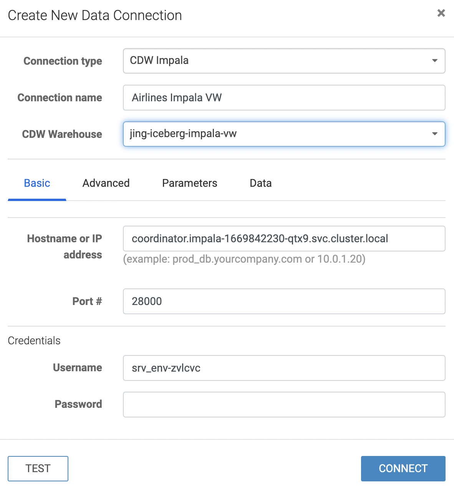
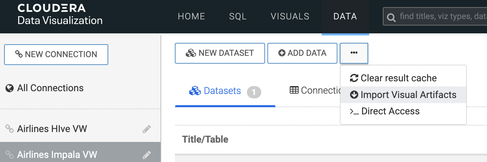
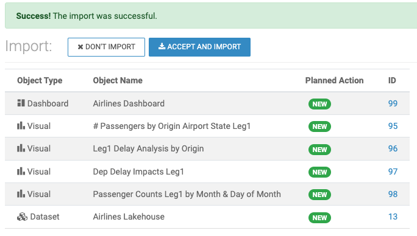
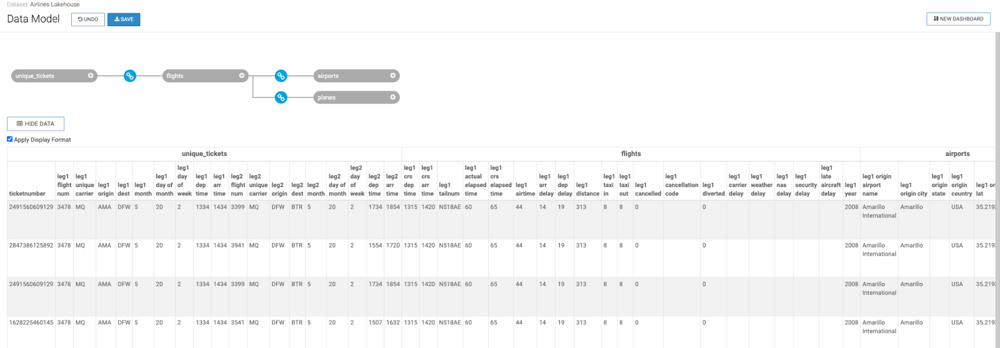
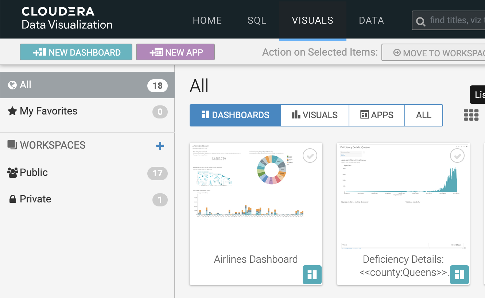
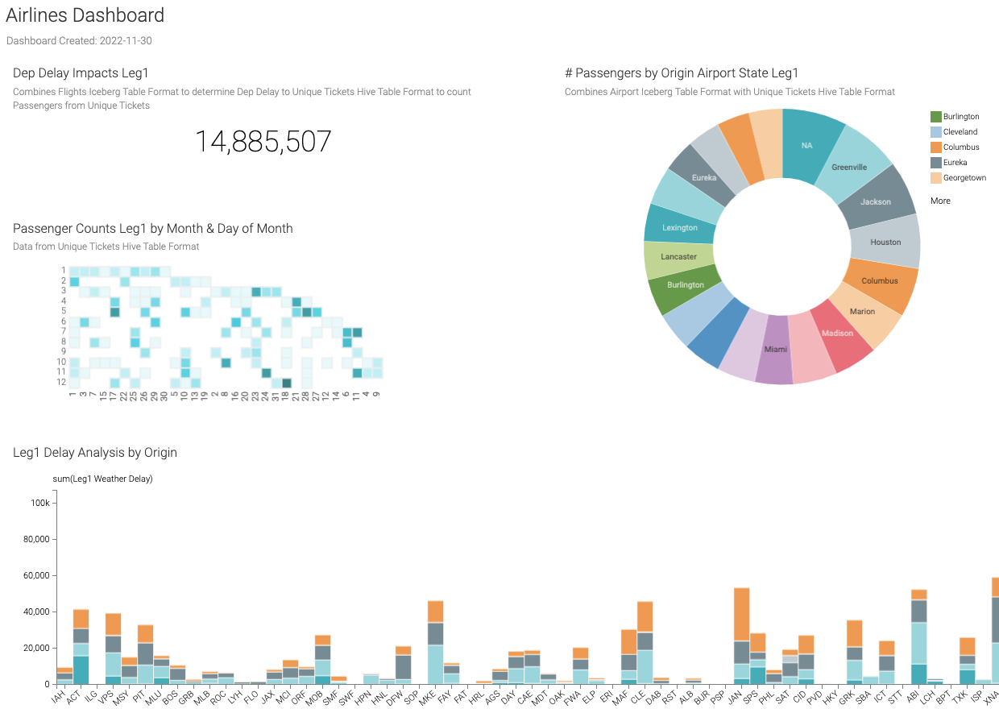

## \[OPTIONAL] Data Visualization (CDV) Setup

- Create or add your user id to a User Group, this will be needed to provide Admin access to CDV

  - These instructions will use a Group named “sales\_process\_demo-admins”

  - To be able to follow these steps you will need to have Admin access in CDV

- Create CDW DataViz instance 

  - In CDW, create a Data Visualization instance (replace \<prefix> with your user id) named **\<prefix>-iceberg-cdv**

    - Size: small

    - Environment: select the environment you have been using for CDW steps

    - Admin Groups: \<sales\_process\_demo-admins> (replace with the group you use, if you choose to use another Group)

- Create a Connection in CDV to the  

  - Open CDV

  - Click on the DATA tab

  - Click on NEW CONNECTION button

  - In CDV, create a Connection named **Airlines Impala VW**

- In CDW Warehouse select the Impala CDW VW named “**\<user\_id>**-iceberg-impala-vw”

- This should fill in details on the Basic tab

- Click on the CONNECT button, there is no need to change anything further including entering a Password (the connection will use your SSO Id to connect to the Impala DB)

* Import CDV Artifacts - Dataset & Dashboard

  - Download the [iceberg\_runbook\_cdv\_v1.json](https://drive.google.com/file/d/1MP9PKmxoh7qpDpoX90Dp6EVSngwhYf2j/view?usp=share_link) file and save it to a place you can remember

  - Click on the “Import Visual Artifacts”

- Select the JSON file - **iceberg\_runbook\_cdv\_v1.json** 

  - Click the checkbox next to “Check data table compatibility” to turn it off

  - Click on the IMPORT button

- Click the ACCEPT AND IMPORT BUTTON

  >>>  

- Click on the DATA tab, you will now have a Dataset named “Airlines Lakehouse”

- Click on the “Airlines Lakehouse” to open the Dataset

  - On the left navigation menu select Data Model

  - To use this Dataset with the Database **\<user\_id>**\_airlines, we need to modify the data model so that all tables point to the tables that you created previously in HUE

    - Click on the button

    - For each of the 4 tables in the Data Model, perform the following

      - Click on the name of each of the tables

      - Database: select the drop down and select **\<user\_id>**\_airlines

      - Table: select the name of the table you are editing

    - Click on the SHOW DATA button, to preview the data. You should see data populated for each of the tables, like the following

- Click on the SAVE button to save changes to the Data Model

* Click on the VISUALS tab

  - Make sure to select the Private WORKSPACE

  - Click on the Dashboard named “Airlines Dashboard”

- If the Dashboard is populated then the setup is complete

